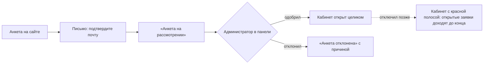
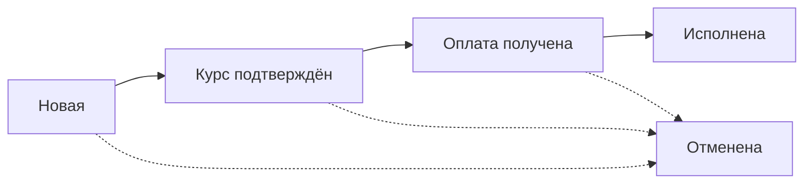
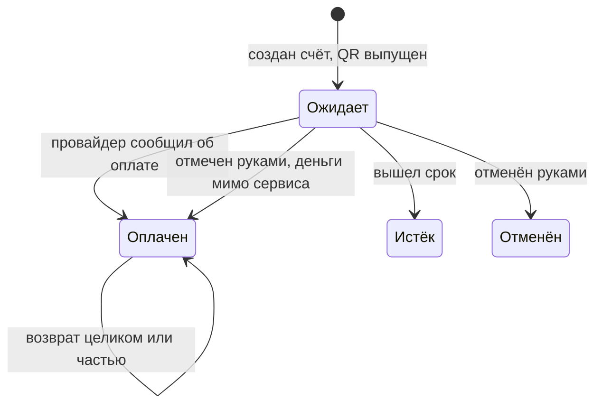
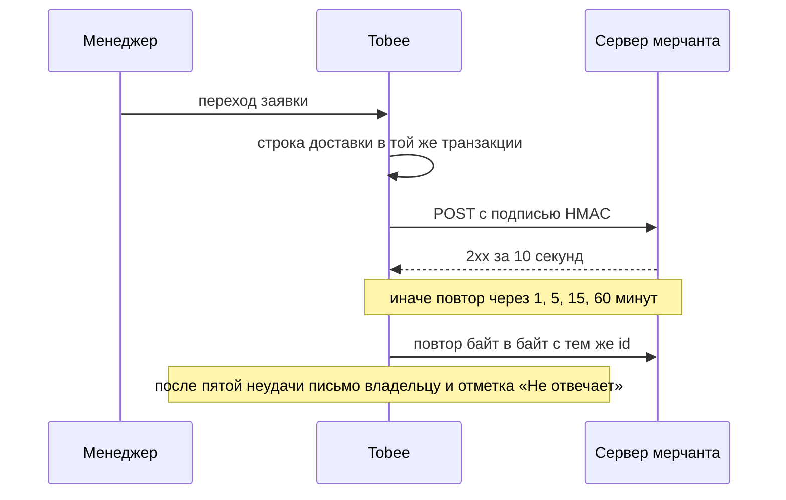

# Кабинет мерчанта Tobee

Состояние на 22 сентября 2026. Документ для показа и рассказа: что
сделано и как оно устроено. Живая копия для презентации ведётся в
Claude Docs; эта — в репозитории, чтобы не расходиться с кодом.
Подробности каждого правила — в `CLAUDE.md`, `CONTEXT.md` и ADR под
`docs/adr/` (0017, 0018, 0022, 0023, 0024).

Кабинет мерчанта работает на боевом контуре с 8 сентября 2026: бизнес
заводит анкету, подаёт заявки на обмен по API, следит за ними,
получает вебхуки и письма, а с 22 сентября 2026 показывает
POS-терминал с имитацией приёма платежа.

## Что это и для кого

Кабинет мерчанта — сайт Tobee для бизнеса, который пользуется сервисом
как услугой обмена: подаёт заявки на обмен за себя или за своих
покупателей, сам их оплачивает и называет, куда отправить деньги.
Боевой адрес — tobeeglobal.com, на корне витрина с двумя дверями;
тестовый контур живёт на адресе sslip.io.

**Мерчант — организация, а не человек.** В кабинет входят её люди, у
каждого своя почта, пароль и роль. У мерчанта нет Telegram, баллов,
рефералки и переписки с менеджером; есть почта, пароль, ключи API и
вебхуки. Цена обмена у него общая с клиентами Mini App: те же курсы,
та же наценка сервиса, те же сетки комиссий.

Две картины использования на одной модели:

- перепродажа обмена своим покупателям: сервис подписок получил рубли
  от покупателя и просит Tobee выплатить валюту на реквизиты этого
  покупателя;
- регулярный обмен своих денег на свои же реквизиты, много и
  программно, через API.

| | Клиент Mini App | Мерчант |
| --- | --- | --- |
| Кто он | человек в Telegram | организация, в кабинет входят её люди |
| Как подаёт заявку | из Mini App | по API своей системой |
| Куда идут деньги | себе на реквизит | себе или своему покупателю |
| Баллы и рефералка | есть | нет |
| Разговор с менеджером | в боте, с помощником | письма и поддержка в Telegram |
| Цена обмена | общая | общая |

**Чем отличается от образца Love&Pay.** Владелец показывал кабинет
платёжного провайдера: там мерчант выставляет счёт покупателю,
покупатель платит по СБП, выручка копится у платформы, мерчант
выводит её и зарабатывает на своей наценке. У Tobee этой цепочки нет:
сервис не принимает деньги покупателя и не ведёт баланс мерчанта.
Взято устройство экранов и разрезы чисел; счета, POS-терминал и
возвраты нарисованы макетом с имитацией платежа.

## Как мерчант попадает в кабинет

Путь один: анкета на сайте, подтверждение почты, решение
администратора в панели, кабинет. До решения мерчант видит один экран
состояния, а не пустые разделы.

Письмо о решении уходит владельцу на почту, ссылка подтверждения
живёт сутки.

**Витрина.** На корне сайта две двери равного веса: «Бизнесу» с
входом по почте и паролю и «Амбассадору» с кнопкой Telegram. Над ними
знак Tobee, повёрнутый в толщу; заголовка и рассказа о сервисе нет,
страница отвечает только на «куда мне войти». Клиенту входить некуда,
и под дверьми стоит кнопка прямо в бота. Вошедшего корень уводит в
его кабинет; у дверей есть адрес `/?doors`, который никого не уводит,
на него ведут выход из кабинетов и знак на экранах входа.

**Вход.** Почта и пароль. Смена пароля и закрытие доступа обрывают
все сессии человека сразу: у каждого своё поколение сессии. Забытый
пароль восстанавливается письмом.

**Экраны состояния вместо кабинета:**

- «Подтвердите почту»: письмо со ссылкой, кнопка выслать новое.
- «Анкета на рассмотрении»: о решении напишем на почту; одобрение
  открывает кабинет целиком.
- «Анкета отклонена»: с причиной, если администратор её назвал.
- Отключённый кабинет открывается: над каждым разделом красная
  полоса, открытые заявки доходят до конца, а что нельзя, решают
  операции, а не спрятанные кнопки.

## Люди и роли

Ролей три, и различаются они тем, чем различается работа: владелец
завёл анкету и отвечает за деньги, оператор работает за стойкой,
наблюдатель смотрит числа. Право проверяет операция, а не спрятанная
кнопка: меню лишь не ведёт туда, где будет отказ.

| Что можно | Владелец | Оператор | Наблюдатель |
| --- | --- | --- | --- |
| Обзор, заявки, курсы, аналитика, поддержка | да | да | да |
| Подача заявок по API (ключ действует как оператор) | да | да | нет |
| POS-терминал: создать счёт, заявить возврат | да | да | нет |
| Наценка терминала (раздел «Настройки») | да | нет | нет |
| Ключи API, вебхуки, подпись запросов | да | нет | нет |
| Сотрудники: завести, сменить роль, закрыть доступ | да | нет | нет |

Правила, которые стоит знать при показе:

- Владелец у кабинета ровно один: роль ему не меняется, доступ не
  закрывается. Ему уходят письма о решении по анкете, о ключах и о
  вебхуках.
- Сотрудника заводит владелец в разделе «Сотрудники» и пароль передаёт
  лично. Приглашение по почте не делается: оно добавило бы
  подтверждение адреса ради ничего.
- Доступ закрывается, а не удаляется: история заявок и ключей
  остаётся. Закрытие обрывает вход в ту же секунду, тем же механизмом,
  что смена пароля.
- Письма о заявке уходят тому, кто её подал; если ему закрыт доступ —
  владельцу.
- Ключ API — то же право подать заявку без пароля, выданное машине.
  Заявка по ключу остаётся без автора, а в карточке видно, каким
  ключом подана.

## Карта разделов

Меню из четырёх групп отвечает на вопросы по мере их появления: что у
меня происходит, чем это делать программно, кто я такой и куда писать.

| Группа | Раздел | Что там | Кому виден |
| --- | --- | --- | --- |
| Работа | Обзор | Строка тревоги, «Сегодня», плитки за период, оборот и средний чек, график, последние заявки | всем |
| Работа | Заявки | Список с поиском по своему номеру, отбором по дате и плитками состояний; карточка с путём заявки | всем |
| Работа | Курсы | Табло направлений с живым курсом, рублёвая пара, расчёт на свою сумму | всем |
| Работа | Аналитика | Разрезы и рекорды за период; пункта в меню нет, вход с обзора | всем |
| POS-терминал | POS-терминал | Счёт покупателю с QR, вид терминала для планшета | владелец, оператор |
| POS-терминал | Счета | Список счетов с оборотом и состояниями, карточка счёта | всем |
| POS-терминал | Возвраты | Заявки на возврат по оплаченным счетам | владелец, оператор |
| Интеграция | API | Ключи API и подпись запросов | владелец |
| Интеграция | Вебхуки | Точки, события, история доставок, пробная доставка, пауза | владелец |
| Интеграция | Как встроить | Правила вебхуков с примером проверки подписи | владелец |
| Интеграция | Журнал вызовов | Каждый вызов API с узнанным ключом, включая отвергнутые | владелец |
| Интеграция | Документация | Договор API, тот же файл, что проверяют тесты | владелец |
| Интеграция | Песочница | Ссылка на тестовый контур с ключами sk_test_ | владелец |
| Кабинет | Сотрудники | Люди мерчанта и их роли | владелец |
| Кабинет | Настройки | Анкета на чтение и смена своего пароля | всем |
| Кабинет | Поддержка | Ник поддержки в Telegram | всем |

Счётчик в меню один, у «Заявок»: незакрытые, то, ради чего кабинет
открывают. Группа, в которой человеку нечего открыть, не показывается
вовсе. Названия «POS-терминал», «Счета», «Возвраты» — дословно со
звонка владельца 8 сентября 2026, а не с образца.

## Обзор и аналитика

Обзор отвечает на «всё ли живо и сколько за период» без единого
клика, аналитика раскрывает те же числа разрезами. Считаются они
одной операцией ядра, и карточка мерчанта в панели показывает
менеджеру те же значения.

**Обзор сверху вниз:**

1. Строка тревоги, если есть беда: «Сбой» (вебхуки не доходят) или
   «Остановлено» (доставка на паузе), с кнопкой «Открыть». В спокойный
   день строки нет вовсе.
2. Приветствие по имени и число незакрытых заявок.
3. Строка «Сегодня»: подано, исполнено, отменено, по часам того, кто
   смотрит.
4. Период с чипами «Сегодня», «7 дней», «30 дней», «90 дней», «Свой
   период»; рядом кнопки «Аналитика» и «CSV заявок».
5. Плитки: Подано, Исполнено, Отменено, В работе, До исполнения,
   Конверсия; владельцу ещё Вызовов API и Доставок вебхуков. Под каждым
   числом «было N» за равный период до выбранного.
6. Карточки «Оборот» и «Средний чек» по каждой валюте отдельно.
7. График «подано и исполнено» с шагом «По дням», «По неделям», «По
   месяцам», «По кварталам»; шаг задаёт глубину ряда и живёт в адресе,
   ссылку можно отправить бухгалтеру.
8. Строка «Интеграция» владельцу: сколько ключей действует, сколько
   точек вебхуков и отвечают ли они.
9. Последние пять заявок.

**Правила счёта, одни на обзор, аналитику и панель:**

- Заявки считаются по дате подачи, деньги по дате исполнения.
- Каждое число сравнивается с равным по длине периодом прямо перед
  выбранным, а не с календарным месяцем.
- Валюты не складываются никогда: исторического курса у сервиса нет, и
  «12 300 RUB · 450 USDT» честнее одного выдуманного числа.
- Конверсия считается по поданным в период, а не делением «исполнено»
  на «подано»: те посчитаны по разным датам, и в неделю разбора хвоста
  дробь дала бы больше ста процентов.
- Получатель в разрезах — человек, а не запись: по API запись
  заводится на каждую заявку заново.

**Аналитика** открывается с обзора и показывает за период: рекорды
(крупнейшая заявка в каждой валюте, быстрая и долгая, самый плотный
шаг), динамику с шагом, воронку заявок с долей закрытых по сроку,
таблицы-разрезы по источникам, способам выдачи, получателям, авторам,
часам и дням недели. У каждой таблицы своя выгрузка CSV. Часы и дни
недели считаются по часам браузера мерчанта.

## Заявки

Заявки заводит интеграция мерчанта по API, а кабинет показывает, где
деньги: список для поиска и карточка с путём заявки. Форма подачи
руками и раздел «Получатели» убраны 19 сентября 2026 по решению
владельца.

**Список.** Первым стоит поиск «Найти заявку» по своему номеру
мерчанта (заказ, бронь, счёт): за одной заявкой сюда приходят чаще
всего. Набранный запрос сам переводит список на «Все», потому что
ищущий не знает, исполнена заявка или отменена. Отбор по дате теми же
чипами, что на обзоре, но открывается список «За всё время»: молча
сузить его до месяца значило бы спрятать заявку. Состояния показаны
плитками, как на обзоре: «В работе» (ждут менеджера или оплаты),
«Исполнены», «Отменены», «Все»; подписи честно меняются на «из
найденных» и «за выбранные даты». Колонки: Отдаю, Получаю, Свой номер,
Состояние, Подана. Список дочитывается кнопкой «Показать ещё 25».

**Карточка.** Заголовком стоит свой номер мерчанта, а не наш: его
знают его система и его покупатель. Подзаголовок называет вид сделки,
источник и ключ: «электронный перевод · подана по API, ключ «сайт» ·
вчера в 17:07». Ниже полный номер в Tobee с кнопкой копирования: по
нему заявку называют в поддержке.

Шагов на пути четыре, а состояний у заявки пять, потому что «новая» и
«в работе» для мерчанта один шаг, разница лишь в том, взял ли заявку
менеджер. Отмена стоит отдельной строкой под путём, а не шагом.

- Путь одного цвета: пройденное залито, будущее пусто, текущий шаг
  мигает медовым, если заявка ждёт мерчанта. Под каждым шагом время и,
  владельцу, вебхуки этого шага: «доставлен, 200», «не доставлен,
  попытка 2 из 5, будет повтор».
- Строка «кого ждёт»: «Заявка у менеджера», «Ждёт вашей оплаты.
  Реквизиты и срок стоят ниже», «Исполнена: деньги отправлены
  получателю».
- Сделка: Отдаю, Получаю, Курс. Курс записан при подаче и не меняется,
  это обязательство сервиса.
- Получатель: вид реквизита, хвост номера и имя держателя, для сверки
  «туда ли перевели». Полного номера в кабинете нет и не будет: ключа
  расшифровки в клиентском контуре нет физически.
- Реквизиты для оплаты по состоянию: у «Курс подтверждён» блок «Куда
  платить» со сроком остатком («до 19:07, осталось 1 ч 12 мин»), у
  оплаченной «Куда платили», у отменённой «Реквизиты больше не
  действуют» и они перечёркнуты. У новой заявки блока нет.
- Отменить заявку из кабинета можно только новую; дальше её ведёт
  менеджер.

Состояния названы теми же словами, что у клиента и у менеджера: Новая,
В работе, Курс подтверждён, Оплата получена, Исполнена, Отменена.
Медовым красится то, что ждёт того, кто смотрит: у мерчанта это «Курс
подтверждён», потому что дальше платит он.

## Курсы

Раздел «Курсы» — табло: один плотный список направлений с курсом,
который меняется прямо на открытой странице. Мерчант приходит с одним
вопросом, «какой у вас курс», и ответ стоит одним экраном. На боевом
контуре пока прежняя версия из трёх карточек; табло выкачено на
тестовый контур 21 сентября 2026.

**Что на табло:**

- Строка расчёта: «Отдаёте» (валюта), «Сумма», «Получаете» с табами
  «Переводом» и «Наличными». Таб наличных не показывается, если
  наличных направлений нет.
- Карточка «USDT и рубль»: «Продаёте USDT», «Покупаете USDT» и
  «Разница» между ними. Отдельно, потому что это единственное
  направление, где сервис стоит по обе стороны.
- Таблица направлений: Пара со значками валют, Курс крупной стороной
  пары («98,04 RUB за 1 EUR», а не «0,0102 EUR за 1 RUB»), Минимум,
  который при набранной сумме становится колонкой «Получите», и
  Котировка с отметкой свежести у каждой строки.
- Знак «?» у колонок открывает объяснение нажатием, теми же словами,
  что в блоке «Как это устроено».
- «Как это устроено» показывает путь денег на живых числах: Отдаёте,
  По курсу, Получаете, на примере или на набранной сумме, и считается
  той же арифметикой, что заявка.

**Откуда число.** Курс тот же, что видит клиент в Mini App: котировка
биржи с наценкой сервиса или ступенчатая сетка комиссии направления.
Отметка свежести у каждой строки своя, потому что биржевая котировка
живёт минуту, а опорный курс банка сутки. Ниже порога направления
выдача не показывается: заявку на такую сумму не примут, и число
читалось бы как обещание.

**Как обновляется.** Сервер держит открытое соединение и присылает
новые числа раз в минуту; изменившийся курс на полторы секунды
подсвечивается цветом, заливкой и полосой слева, чтобы сигнал был
виден и тем, у кого выключена анимация. Курс на табло живой; замирает
он только в момент подачи заявки.

## POS-терминал, счета и возвраты

Три экрана повторяют кассу образца целиком, но денег за ними нет:
платёж принимает имитация провайдера, и об этом сказано словами на
каждом экране. Записи живут в памяти сервера до перезапуска, в базе
сущностей счёта и возврата нет. Банк, когда появится, встанет за тот
же интерфейс, и экраны не изменятся (ADR-0024).

**POS-терминал.** Кнопки валют покупателя со значками — те же, что на
табло «Курсов», — сумма в рублях или в валюте, быстрые суммы, галочка
«Требовать верификацию». Итог называет обе стороны одним кеглем:
«Покупатель заплатит» и «Получит», под ними курс с наценкой. Сумма к
оплате округляется вверх до целого рубля. Блок «Как это устроено»
показывает путь денег на набранной сумме — платит, по курсу, получает,
— тем же приёмом, что на табло курсов. После «Создать счёт» на месте
формы встаёт сам счёт: номер, сумма, QR, отсчёт до перевыпуска QR и до
срока счёта, кнопки «Покупатель заплатил», «Отменить счёт»,
«Следующий покупатель», «Открыть счёт». Справа последние счета, и
обновляются они сами; над ними кнопка «Все счета» в раздел «Счета».

Срок счёта тот же, что у неоплаченной заявки на обмен, и задаёт его
администратор; QR перевыпускается каждые пять минут, как у СБП.

**Что делает имитация вместо банка.** Выдаёт QR, содержимое которого
нарочно не похоже на ссылку банка. Кнопка «Покупатель заплатил» уходит
в ту же точку, куда у банка придёт сообщение об оплате; с настоящим
провайдером кнопка отказывает. Верификация у имитации проходит вместе
с оплатой и остаётся строкой в ленте счёта. Возврат имитация исполняет
сразу.

**Наценка владельца** — в разделе «Настройки» кабинета: от 0 до 100 %
поверх курса сервиса, его доход с продажи у стойки, записывается в
каждый счёт вместе с курсом. Её правят раз в месяц, и на экране кассы
она только названа строкой под кнопкой «Создать счёт», со ссылкой в
настройки для того, кому менять её можно.

**Счета.** Плитки «Всего счетов», «Оплаченные счета», «Оборот в RUB»
по курсу каждого счёта, «По валютам» без сложения; состояния Ожидает,
Оплачен, Истёк, Отменён; поиск по номеру счёта, личный набор колонок,
выгрузка CSV.
Карточка счёта: сумма и эквивалент по записанному курсу, QR пока счёт
ждёт денег, провайдер, верификация, лента «Что происходило»,
действия.

**Возвраты.** Заявка заводится в карточке оплаченного счёта, целиком
или частью, с причиной, и считается от остатка, а не от суммы счёта.
Плитки «Заявок», «Ждут решения», «К возврату» по валютам. Комиссия
при возврате не считается: у кого она удерживается, владелец не
назвал.

**Примеры для показа.** По переменной окружения `POS_DEMO_SEED=1`
кабинет заводит мерчанту без счетов четырнадцать примерных счетов за
десять дней во всех состояниях и два возврата, каждый подписан словом
«пример». На боевом контуре не включать.

## Интеграция

Интеграция — главный способ работы мерчанта: его система подаёт
заявки по API и узнаёт о переходах вебхуками. Сторонний разработчик
подключается по разделам кабинета, не задавая вопросов поддержке.

**API v1.** Адрес `/api/v1` на том же домене, что кабинет. Ключ
выпускается в разделе «API», показывается один раз и передаётся в
заголовке запроса; боевые ключи начинаются с sk_live_, песочницы с
sk_test_. Операций девять.

| Операция | Что делает |
| --- | --- |
| GET /rates | Направления и курс каждого для наименьшей суммы |
| POST /quote | Котировка на сумму с любой стороны, с отметкой времени |
| GET /exchange-requests | Свои заявки, свежие первыми, с курсором |
| POST /exchange-requests | Подать заявку; заголовок Idempotency-Key обязателен |
| GET /exchange-requests/{id} | Одна заявка; чужая отвечает «не найдена» |
| POST /exchange-requests/{id}/cancel | Отменить, пока менеджер не взял |
| GET /requisites | Сохранённые получатели |
| POST /requisites | Сохранить получателя |
| DELETE /requisites/{id} | Архивировать получателя |

Правила договора: деньги строками, время в UTC; получатель в заявке
либо сохранённый, либо названный прямо в теле; отметка времени
котировки закрепляет курс на пять минут; повтор подачи с тем же
ключом возвращает ту же заявку. Ошибка приходит кодом для машины и
словами для человека. Пределы: сто вызовов в минуту и тысяча в час на
ключ, сверх них ответ 429 с указанием, сколько ждать. Подпись
запросов включается по желанию, включённая обязательна: перехваченный
запрос нельзя изменить или повторить.

**Вебхуки.** Мерчант заводит точки: адрес, набор событий, секрет для
проверки подписи. События: заявка принята, курс подтверждён, оплата
получена, исполнена, отменена и пробное. Тело тонкое, без сумм и
реквизитов, подробности берутся по API.

Порядок доставки не гарантирован, дубли возможны, и приёмник обязан
отбрасывать повтор по id. Адрес точки — только https на публичное
имя. Пауза останавливает новые события, начатые доходят до конца.
Пробная доставка кнопкой проверяет приёмник и подпись до первой
настоящей заявки. Журнал доставок показывает код, начало тела и время
ответа сервера мерчанта.

**Как встроить.** Отдельная страница для разработчика мерчанта:
заголовки запроса, поля тела, проверка подписи на Node.js, Python и
PHP, правила повторов и тела событий байт в байт. Числа и примеры
берутся из ядра, а пример на Node.js исполняется тестом, поэтому
страница не отстаёт от кода.

**Журнал вызовов.** Каждый вызов с узнанным ключом за тридцать дней,
включая отвергнутые: код, время, слова отказа. Плитки «Успешных за
сутки», «С ошибкой за сутки», «Среднее время ответа». Вызов с
незнакомым ключом ничей и в журнал не попадает.

**Документация и песочница.** Страница «Документация» строится из
того же файла договора, который тест сверяет с маршрутами, без чужих
скриптов. Песочница — тот же кабинет и то же API на своём адресе со
своей базой; деньги там не ходят, а код, собранный на sk_test_,
переводится на бой заменой ключа и адреса.

## Письма мерчанту

Мерчанту сервис пишет письмом, а не в Telegram, и ни в одном письме
нет реквизитов для оплаты: почтовый ящик сервису не принадлежит, а
перевод по подменённым реквизитам не возвращается. Письмо зовёт в
кабинет, где реквизиты показаны за паролем.

| Тема | Когда | Кому |
| --- | --- | --- |
| Подтвердите почту | после заведения анкеты; ссылка живёт сутки | владелец |
| Смена пароля | по просьбе «забыл пароль»; ссылка живёт час | тот, кто просил |
| Анкета одобрена | решение администратора | владелец |
| Анкета отклонена | решение администратора, с причиной | владелец |
| Выпущен ключ API | выпуск ключа; сам ключ письмом не отправляется | владелец |
| Ключ API отозван | отзыв ключа | владелец |
| Вебхук не доставляется | пять неудач подряд; одно письмо на приступ | владелец |
| Курс подтверждён, заявка ждёт оплаты | менеджер выдал реквизиты; в письме срок, а не реквизиты | подавший заявку |
| Оплата получена | менеджер подтвердил поступление | подавший заявку |
| Заявка исполнена | деньги отправлены получателю | подавший заявку |
| Заявка отменена | менеджером или по сроку, с причиной | подавший заявку |
| Срок оплаты заявки истекает | незадолго до отмены по сроку | подавший заявку |

Писем о новой и взятой в работу заявке нет: мерчант только что подал
её сам. Если подавшему закрыт доступ или заявка пришла по ключу API,
письмо уходит владельцу. В подписи каждого письма адрес кабинета и
ник поддержки в Telegram. Тексты писем живут в коде рядом с текстами
бота и проходят ту же проверку на машинный набор.

Провайдер почты — Resend, одним HTTPS-запросом. Режим задаётся при
развёртывании: отправка через провайдера или запись письма в журнал
сервера, так сейчас на обоих контурах. Пока домен отправителя не
подтверждён записями DNS, настоящие письма на чужие ящики не уходят,
и это первое, что нужно до первого настоящего мерчанта.

## Безопасность

Главное решение: кабинет стоит в клиентском контуре и реквизиты
только шифрует, а расшифровывает их менеджер в панели. Приватного
ключа в кабинете нет физически, и взлом кабинета не отдаёт ни одного
номера карты.

| Что | Как устроено |
| --- | --- |
| Три приложения | Mini App, панель менеджера и кабинет — отдельные деплои. Ключ расшифровки реквизитов есть только у панели. |
| Пароль | Хранится хешем argon2id. Сессия — подписанная кука с поколением: смена пароля или закрытие доступа обрывает все сессии разом. |
| Ключ API | В базе лежит только хеш SHA-256; секрет показывается один раз и отзывается по одному. По желанию владелец включает подпись HMAC каждого запроса. |
| Пределы | На ключ API — сто запросов в минуту и тысяча в час. На вход — счётчик попыток по адресу. |
| Изменяющие запросы | Принимаются только со страницы самого кабинета и только в JSON: чужой сайт не может отправить запрос от имени вошедшего. |
| Реквизиты | Шифруются при подаче, в кабинете виден только хвост номера. Каждый показ полного номера менеджером пишется в журнал доступа. |
| Письма и вебхуки | Реквизитов для оплаты в них нет никогда, тело вебхука тонкое, без сумм. Оба зовут в кабинет. |
| Адрес вебхука | Только https на публичный хост; куда имя указывает, проверяется перед отправкой, во внутреннюю сеть воркер не ходит. |
| Права | Проверяет операция, а не разметка: спрятанная кнопка обходится прямым запросом, операция — нет. |

Разбор безопасности кабинета делался дважды, 14 и 17 сентября 2026;
найденное исправлено и закреплено тестами. Второго фактора у мерчанта
пока нет.

## Что видит менеджер в панели

В панели менеджера есть раздел «Мерчанты»: список с активностью за
тридцать дней и карточка каждого. Заявки мерчанта стоят в общем столе
с пометкой «Мерчант» и ведутся теми же операциями, что заявки
клиентов.

Карточка мерчанта сверху вниз:

- Название и состояние: На рассмотрении, Активен, Отклонён, Отключён;
  когда подана и одобрена анкета.
- Анкета: что собираются делать, контакты, сайт.
- Решение, только администратору: «Одобрить», «Отклонить» с причиной,
  которую прочитает мерчант, «Отключить» и «Включить». Одобрение
  открывает право создавать обязательства сервиса по курсу, поэтому
  менеджеру оно не отдано.
- Числа за период: те же плитки и тот же оборот, что мерчант видит у
  себя на обзоре. Считает одна операция, и «у нас исполнено
  двенадцать» против «у вас одиннадцать» случиться не может.
- Ключи API: подпись, хвост, когда выпущен, последний вызов, действует
  или отозван. Отзывает сам мерчант, панель только видит.
- Вебхуки: адреса точек, события, счёт доставок и последняя;
  неотвечающая точка отмечена медовым: она зовёт человека.
- Заявки мерчанта со ссылкой «Все в столе».

Реквизиты получателя менеджер открывает в карточке заявки так же, как
у клиента: показ записывается в журнал доступа. Ник поддержки
мерчантов, который стоит в кабинете и в письмах, задаётся
администратором в настройках панели; на боевом контуре он пока не
задан.

## Чего в кабинете нет и почему

Всё, чего нет, отсутствует по решению, а не по забывчивости; причины
записаны в `backlog.md`.

| Чего нет | Почему |
| --- | --- |
| Баланс мерчанта и вывод средств | По закону о национальной платёжной системе (161-ФЗ) обязанным по электронным деньгам может быть только кредитная организация. Баланс «у нас в системе» — эмиссия без лицензии. Легальные пути: агрегатор при партнёрском банке, вовсе не касаться денег, зарубежная лицензия. Решение за юристом. |
| Настоящий приём оплаты по СБП-QR | Ждёт доступов в банке. Экраны готовы и работают на имитации; банк встанет за тот же интерфейс. |
| Комиссия платформы с оплаченного счёта и удержание при возврате | Владелец не назвал, у кого удерживается комиссия при возврате: у покупателя (его слова) или у мерчанта (как у образца). Выдуманный процент читался бы как наш тариф. |
| Проверка личности покупателя (KYC) | Есть только галочка на счёте в терминале, проверку делал бы провайдер приёма. Своего провайдера проверки нет. |
| Приём оплаты в крипте по ссылке | Не решено, чей кошелёк принимает, какая комиссия сервиса и кто проверяет входящие. Сеть BEP-20 при этом заведена. |
| Второй фактор входа | У сотрудника сервиса он есть, потому что тот видит чужие деньги; у мерчанта отложен. |
| Переписка с менеджером в кабинете, английский язык, PDF-выписка | Отложены: выгрузка есть в CSV, поддержка через Telegram, спроса на английский не было. |
| Форма подачи заявки руками и раздел «Получатели» | Убраны 19 сентября 2026: заявки заводит интеграция мерчанта по API, а получатель виден в карточке заявки и в разрезе аналитики. |
| Реквизиты для оплаты в письмах и вебхуках | Никогда: почтовый ящик сервису не принадлежит, перевод по подменённым реквизитам не возвращается. Письмо и вебхук зовут в кабинет. |

Отдельно про регуляторику 2026 года: с 1 сентября обмен цифровых
валют стал лицензируемым, а биржи, у которых сервис читает
котировки, попали под санкции ЕС. Это не про кабинет, но задевает
сервис целиком и требует проверки юристом.

## Хронология

Кабинет сделан за шестнадцать дней сентября 2026, от подтверждения
идеи до имитации приёма платежа.

| Дата | Что сделано |
| --- | --- |
| 22 сентября | POS-терминал с имитацией приёма платежа: QR, срок счёта, «Покупатель заплатил», наценка владельца, верификация, возврат через провайдера, живая история, примеры (ADR-0024). Выкачено на тестовый контур 22 сентября вечером, в прод не выкачено. |
| 22 сентября | Правки терминала по словам владельца: обе суммы одним кеглем, кнопки валют как в «Курсах», путь денег в «Как это устроено», наценка перенесена в «Настройки», «Вид терминала» и поля «Назначение» и «Покупатель» убраны. |
| 21 сентября | Раздел «Заявки» заново: поиск по своему номеру, путь заявки, срок остатком, отбор по дате; ключ API у заявки. Выкат в прод. Табло курсов с живым обновлением на тестовом контуре. |
| 19–20 сентября | Светлая тема «Терминал» с акцентом индиго, обзор с шагом графика (дни, недели, месяцы, кварталы). Форма подачи и «Получатели» убраны: заявки заводит интеграция. |
| 18 сентября | Свой домен tobeeglobal.com: кабинет на корне, Mini App и панель на поддоменах. |
| 17 сентября | Проверка панели и кабинетов: защита изменяющих запросов, адрес дверей `/?doors`, который никого не уводит. Начата переделка кабинета. |
| 14–15 сентября | Разбор безопасности кабинета, исправления проверены на тестовом контуре. |
| 12 сентября | Сотрудники мерчанта и три роли (ADR-0023). Названия на экранах заменены словами владельца со звонка. |
| 11 сентября | Сеть BEP-20, страница «Как встроить» про вебхуки, аналитика с разрезами, POS-терминал, счета и возвраты макетом. Выкат в прод. |
| 10 сентября | Витрина с двумя дверями и кабинет амбассадора (ADR-0022). Спека кабинета переписана целиком. |
| 8 сентября | Выкат в прод «как есть» на временном адресе. Звонок с владельцем «Nail Story»: заказаны POS-терминал, счета, возвраты и сотрудники. |
| 7 сентября | API v1 с ключами, подписью и лимитами; вебхуки очередью в базе (ADR-0018); заявка руками, получатели, курсы; статистика мерчанта. Выкат на тестовый контур. |
| 6 сентября | Владелец подтвердил идею: кабинет для бизнеса, сайт, не Telegram. Ядро мерчанта (ADR-0017), раздел «Мерчанты» в панели, письма, само приложение кабинета: регистрация, вход, обзор, заявки, настройки, поддержка. |

## Как показать

Показывать на тестовом контуре, не на боевом: там есть демо-мерчант с
заявками, а на боевом мерчантов нет.

- Адрес тестового кабинета:
  app-input-open-source-array-i77zih-0d6d6a-177-7-34-106.sslip.io.
  Демо-мерчант с заявками — test@oplatishka.example, пароль у Пенкина.
  Второй демо-мерчант, oplatishka@example.com, без заявок.
- Перед показом проверить, что кабинет отвечает, и что ветка с
  имитацией POS выкачена на тестовый контур, а примеры счетов включены
  переменной окружения. На вечер 22 сентября 2026 и то, и другое
  сделано: кабинет dev на версии be90d1f, примеры включены.

**Порядок показа:**

1. Витрина с двумя дверями, вход «Бизнесу».
2. Обзор: строка «Сегодня», плитки с сравнением, переключить период и
   шаг графика, кнопка «Аналитика».
3. Заявки: поиск по своему номеру, плитки состояний, карточка с путём,
   сроком и получателем.
4. Курсы: набрать сумму и показать, как колонка становится
   «Получите»; дождаться подсветки изменившегося курса.
5. POS-терминал: раскрыть «Как это устроено» и показать путь денег на
   набранной сумме, создать счёт, показать QR и отсчёт, нажать
   «Покупатель заплатил» и увидеть «Оплачено!»; сменить наценку в
   «Настройках» и вернуться — цена пересчитается.
6. Счета и возвраты: открыть оплаченный счёт, заявить частичный
   возврат, показать список.
7. Интеграция: ключи API, вебхуки с историей доставок, «Как встроить»,
   журнал вызовов, документация.
8. Сотрудники: завести оператора, показать, что он не видит
   интеграцию.

**Словарь**

| Слово | Значение |
| --- | --- |
| Мерчант | Бизнес, который пользуется сервисом как услугой обмена; организация, а не человек. |
| Сотрудник кабинета | Человек мерчанта со своей почтой, паролем и ролью. |
| Заявка на обмен | Запрос на обмен одной валюты на другую, который исполняет менеджер; у заявки мерчанта есть его свой номер. |
| Получатель | Куда мерчант просит отправить деньги: себе или своему покупателю. |
| Курс заявки | Курс, записанный при подаче; обязательство сервиса, менеджер его не меняет. |
| Срок оплаты | Сколько неоплаченная заявка ждёт после выдачи реквизитов; задаёт администратор. Тот же срок у счёта в терминале. |
| Наценка сервиса | Надбавка к биржевому курсу, одна на весь сервис; отдельно от наценки мерчанта в терминале. |
| Ключ API | Строка sk_live_ или sk_test_, которой система мерчанта удостоверяет себя. |
| Вебхук | Сообщение о переходе заявки на адрес мерчанта с подписью. |
| Песочница | Тестовый контур глазами мерчанта: то же API с ключами sk_test_, деньги не ходят. |
| Амбассадор | Клиент с отметкой, у которого свой кабинет на том же сайте с входом через Telegram. |
| Провайдер приёма | Тот, кто принимает деньги покупателя по счёту терминала; сейчас имитация, потом банк. |
